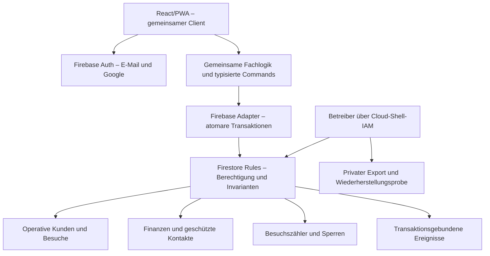

# HeimFriseur – Architektur-, Sicherheits- und Qualitätsaudit

Datum: 07.10.2026. Quellstand: Version 6.4.0, Branch `firebase-spark`, lokaler Commit `da715b4`; veröffentlichter Commit mit identischem Änderungssatz `9861d20614927a9f8fcd02340cb6b21ad75ff521`.

## 1. Executive Summary

Die App besitzt eine brauchbare Grundlage: bestätigte Anmeldung, getrennte Unternehmensdaten, geschützte Plattform-Admin-Registry, ausgelagerte Finanzdokumente, Transaktionen gegen doppelte Behandlungsstarts, deutsche Formulare, automatische Speicherung und PWA-Updates. Die bisherigen positiven Workflow-Tests bestehen.

**Für eine Freigabe mit echten Kundendaten sind jedoch zunächst drei wesentliche Befunde zu beheben:** Rechnungsempfänger-Daten sind über operative Zahlungsdokumente ohne Abrechnungsrecht lesbar; Mitarbeiter können einen Besuch über direkte Firestore-Zugriffe trotz offener Kunden/laufender Behandlung schließen; Behandlungen lassen sich mit negativen Zeiten und ohne konsistenten Finanzabschluss speichern. Dazu kommen bestätigte Schwächen bei Rollen-Konsistenz, Ereignisprotokollen und Geldarithmetik.

Das ist kein Beleg für einen anonymen Vollzugriff. Fremde, anonyme und unbestätigte Konten sowie die getestete Selbstbeförderung wurden abgewiesen. UI-Prüfungen und erfolgreiche Alltagstests sind aber kein Ersatz für vollständige serverseitige Invarianten.

**Ergebnis:** Testbetrieb mit künstlichen Daten sinnvoll; Freigabe für echte personenbezogene Daten erst nach den P1-Korrekturen und erneuter Prüfung. Keine Cloud-Daten, Rollen oder produktiven Regeln wurden für dieses Audit verändert.

## 2. Umfang und Beweislage

Geprüft wurden Frontend, gemeinsamer Workflow, Firebase-Repository, Firestore-Regeln/Indizes, Auth-Brücke, Supabase-Migrationen 001–008, PWA/Deployment-Konfiguration, Operatorwerkzeuge und Test/CI-Struktur. Acht Prüfbereiche: die sieben genannten Bereiche plus Betrieb, Updates und Wiederherstellung.

Tatsächlich ausgeführt:

- TypeScript und beide Builds bestanden. Firebase-Ausgabe `dist-firebase`, Supabase-Ausgabe `dist`.
- 71 lokale Tests bestanden; 1 Firebase-Integrationstest wird im normalen Lauf erwartungsgemäß übersprungen und separat mit Emulator ausgeführt.
- Firestore-Sicherheitschecks und der Firebase-Workflow-Integrationstest bestanden separat.
- Zusätzliche direkte API-Proben reproduzierten sechs Mängel. Ergebnisse: `firestore-probe-results.json`; ausführbare Proben: `firestore-probes.mjs`.
- `npm audit`: 0 gemeldete Schwachstellen im aktuellen Lockfile. Das ist keine Garantie für unbekannte Schwachstellen.
- Musterprüfung der versionierten Arbeitsdateien: keine privaten Schlüssel, Supabase-Secret-Keys oder eingebetteten PostgreSQL-Passwörter gefunden. Öffentliche Firebase-Konfiguration und Supabase-Publishable-Key sind keine privaten Backend-Schlüssel. Git-Historie, CI-Secrets und Cloud-IAM wurden nicht vollständig gescannt.
- Die öffentlichen HTTP-Header der Testwebsite enthalten CSP, HSTS, `X-Frame-Options: DENY`, `nosniff` und `Referrer-Policy: no-referrer`. Öffentliches `version.json` meldete 6.4.0. Daraus folgt nicht, dass die richtigen Datenbankregeln/Rollen live installiert sind.
- Die beigefügten TypeScript-Lösungsvorschläge für Centbeträge, Monatswechsel und Dauer wurden separat typgeprüft und gegen Randfälle getestet.

**Nicht direkt prüfbar:** echte Firebase-/Supabase-IAM-Rechte, Auth-Konsole, SMTP-Zustellung, OAuth-Konfiguration, laufende Nutzerzuordnungen, produktive Firestore-Regelversion, Provider-Backups, Datenschutzverträge und reale Gerätekombinationen. Die vorherige mobile Browserprüfung von 6.4.0 ist ergänzende Evidenz; dieses Audit ersetzt keinen Safari-/Android-/Screenreader-Gerätetest.

## 3. Priorisierte Mängelliste

### 🚨 Kritisch für die Freigabe – P1

| ID | Befund und Beleg | Auswirkung | Lösung / Abnahmekriterium |
|---|---|---|---|
| SEC-01 | `src/firebaseData.ts:49` entfernt bei `treatment_payments` nur `amount`. Name/Adresse bleiben erhalten. `firestore.rules:112` erlaubt operative Dokumente im Heim-Scope. Direkter Lesezugriff mit `view_billing:false` erfolgreich. | Rechnungsempfänger-Daten sind ohne das vorgesehene Recht sichtbar. Die App blendet Daten aus, die API liefert sie trotzdem. | Kontaktsnapshots in eine geschützte Collection verschieben; operative Zahlungsdaten strikt auf Status/Art/IDs beschränken. Altdokumente bereinigen. Direkter Mitarbeiterzugriff muss anschließend scheitern; Geschäftsführerzugriff und Zahlungsstatus müssen weiter funktionieren. |
| LOGIC-01 | `firestore.rules:129` prüft beim Abschluss nur Zuweisung, Abschlussrecht und Verantwortlichen. Direkter Statuswechsel nach `Abgeschlossen` trotz offener Kunden/laufender Behandlung erfolgreich. `workflowRepository.ts:652` prüft dies nur im Client. | Besuche und Auswertungen können widersprüchlich werden; Arbeitsablauf kann hängen bleiben. | Zustandsübergänge und konsistent fortgeschriebene Besuchszähler serverseitig erzwingen; Abschluss nur bei offen=0 und laufend=0. Negativtests für Abschluss, Wiedereröffnung und ungültige Übergänge. |
| LOGIC-02 | `firestore.rules:134` erlaubt bei laufender Behandlung Änderungen an `end_time`, `duration_minutes` und Snapshots ohne vollständige Konsistenzprüfung. Ende 1900 und Dauer −123 wurden akzeptiert, ohne passenden Finanzabschluss. | Zeit, Kundenstatus, Sperren und Finanzstatus können auseinanderlaufen. | Atomarer Abschluss mit validen Zeitwerten, passendem Finanzstatus, erledigtem Kunden und freigegebenen Sperren. Dieselben Anforderungen in Rules prüfen, nicht nur im Repository. |

Keine bestätigte P0-Lücke wie anonymer Vollzugriff oder ein offengelegter privater Hauptschlüssel gefunden. Die P1-Befunde sind dennoch Freigabeblocker.

### ⚠️ Warnung – P2

| ID | Befund und Beleg | Konkrete Verbesserung |
|---|---|---|
| MATH-01 | Firestore `validFinance` und JS rechnen mit Euro-Gleitkommazahlen und exakter Gleichheit. Probe: 0,30 abgewiesen, 0,1+0,2 = 0,30000000000000004 akzeptiert. | Finanzfelder in Firebase als ganzzahlige Centbeträge speichern; Eingaben mit maximal zwei Dezimalstellen validieren. SQL `numeric(12,2)` behalten, API-Umwandlung zentralisieren. Historische Werte bei Migration abgleichen. |
| AUTH-01 | Ein Geschäftsführer kann ein zweites Teammitglied mit `role:'owner'` setzen, ohne `owner_user_id` der Firma zu ändern. Reproduziert. Root-Eigentümer und Teamrolle driften auseinander; `permission()` vertraut zusätzlich auf Team-`owner`. | Genau ein aktiver Geschäftsführer; Rolle `owner` nur für die Root-UID zulassen. Geschäftsführerwechsel als atomare Operation. Plattform-Admin und Unternehmens-Administrator getrennt erhalten. |
| AUDIT-01 | Mitarbeiter können unter `/audit` beliebige Aktionsnamen und erfundene Datumswerte anlegen. Reproduziert: `business_role_changed` mit Datum 1900. Außerdem verlangen viele Fachschreibzugriffe keinen neuen Auditdatensatz. | Aktions-/Feld-Allowlist, echte Serverzeit und Verknüpfung mit Fachtransaktion. Keine beliebigen Details. Privilegierte Labels nur für passende Rolle. Ein clientseitiges Protokoll nicht als manipulationssicheren Server-Audit-Trail bezeichnen. |
| AUTH-02 | Firebase nutzt dauerhaftes lokales Auth-Persistence; `signed()` kontrolliert E-Mail, aber keinen serverseitigen Session-Sperrzeitpunkt. Supabase prüft bestätigte E-Mail/MFA, jedoch keinen `session_id` gegen `auth.sessions`. | Remote-Abmeldung/Token-Widerruf operativ vorsehen. Bei besonders sensiblen Aktionen frische Anmeldung verlangen. Geschützten Kontosperr-/`valid_after`-Datensatz prüfen, falls sofortige Sperre erforderlich ist. Bestehende Firebase-ID-Tokens können nach einer Auth-Sperre bis zum Ablauf gültig bleiben; Team-/Admin-Rechte werden dagegen anhand aktueller Dokumente geprüft. |
| AUTH-03 | 12 Zeichen werden im Registrierungsformular verlangt; produktive Firebase-Passwort-Policy, Google-Freigabe und E-Mail-Zustellung sind nicht belegt. Firebase-Brücke meldet immer `aal1`; keine native Firebase-MFA-Absicherung vorhanden. | Passwort-Policy in Konsole setzen; verifizierte E-Mail, Reset und Google-Linking live testen. Kein MFA-Versprechen im Spark-Betrieb. Admins sollen ihre Google-Konten extern mit 2FA absichern; providerseitige MFA ist nicht automatisch eine von der App geprüfte MFA-Garantie. |
| CACHE-01 | `store.tsx:231` leert sensible Daten nur bei SQL-Code `42501`. Firebase-RPC normalisiert `permission-denied` zwar, der direkte Pfad `firebaseSnapshot()` tut dies nicht. Dort können rohe Firebase-Codes auftreten; statisch gefundener Randfall, kein nachgewiesener Fremdzugriff. | Auch diese Codes erkennen und Store/Repository-Cache bei Autorisierungsverlust leeren. Netzwerkfehler weiter gesondert behandeln, damit ungespeicherte Entwürfe nicht unnötig verloren gehen. Bereits auf ein Gerät ausgelieferte Daten können nicht rückwirkend ungeschehen gemacht werden. |
| DATE-01 | `Calendar.tsx:22` verschiebt den Monat ohne vorher den Tag zu normalisieren. 31.01.2026 + ein Monat ergibt 03.03.2026; Februar wird übersprungen. | Bei Monatsansicht vor Verschieben auf Tag 1 setzen. Tests für 29/30/31, Schaltjahr und Jahreswechsel. UTC/Berlin-Trennung bei Zeitinstanten beibehalten. |
| ARCH-01 | Unternehmensadmin wird als `employee + company_admin` gespeichert, als synthetischer `owner` geladen und zusätzlich gibt es globale Admins. `permission()`/`owner()`/UI interpretieren diese unterschiedlich. | Explizites Rollenmodell und zentrale Capability-Matrix statt weiterer Sonderfälle. Root-Eigentümerkennung unabhängig von historischen `user_id`-Fachfeldern machen. Kein ungeprüfter Big-Bang-Umbau. |
| PERF-01 | Geschäftsführer laden sämtliche operative und finanzielle Historie, globale Admins auch komplette Nutzer-/Auditverzeichnisse. Geschäftsführungswechsel schreibt Besitzerfelder in allen Fachdatensätzen und stoppt über 300 Datensätzen. Repository begrenzt Änderungen auf 350 Dokumente; großes Katalogdokument wächst Richtung Firestore-Dokumentlimit. | Zeitfenster/Pagination und Mapping per ID; Firmenkennung als stabile Datengrenze, CEO-Wechsel ohne Rewrite aller historischen Behandlungen. Messbare Grenzen für große Besuche vor dem Speichern anzeigen. Katalog ggf. aufteilen; Regeln-/Zugriffslimits berücksichtigen. |
| ROBUST-01 | Kein React Error Boundary in `main.tsx`; Registrierung des Service Workers kann eine unbehandelte Promise-Rejection liefern. | Fehlergrenze mit verständlicher Wiederherstellung; Registrierung mit Catch. Technisches Logging ohne E-Mail, Notizen, Bilder oder Tokens. Fehlercode/Korrelation statt Rohpayload. |
| QA-01 | Die Firebase-Branch-CI prüft Builds/Unit/Emulator, aber nicht `firebase-browser-check.mjs`. Die Main-/PR-CI integriert bereits die bisherigen Browser-Skripte. Firebase-Workflow ist ein großer Integrationstest; erfolgreiche Tests deckten die sechs reproduzierten Fälle nicht ab. | Befunde in einzelne Negativ-/Regressionstests umwandeln; mobile Browserprüfung und Rollenmatrix in CI integrieren. Echte Google-/E-Mail-Tests separat als manuelle Freigabeschritte. |
| OPS-01 | Regeln und Frontend werden gemeinsam angeboten, aber aktive Altclients/PWA-Versionen bleiben bis zur Aktualisierung möglich. Operatorwerkzeuge sichern nur bei bestimmten Eingriffen; umfassende reguläre Backups/Wiederherstellung nicht nachgewiesen. | Schema-/Regeländerungen kompatibel in Stufen ausrollen; Mindestversion nur mit Entwurfsschutz. Regelstand/Build-ID dokumentieren. Regelmäßige geschützte Exporte über autorisierte lokale/IAM-Werkzeuge und echte Wiederherstellungsprobe; kein kostenpflichtiger Anbieterwechsel nötig. |

**Zusätzlicher Betriebsbefund OPS-02:** `.github/workflows/firebase.yml` baut weiterhin
`npm run build` (Supabase) und ersetzt die Hosting-Konfiguration durch `firebase.clean.json`.
Wer diesen allgemein benannten manuellen Workflow auf dem Firebase-Branch auswählt,
kann dadurch die bisherige Hosting-Site mit dem falschen Backend veröffentlichen.
Dieser Workflow ist für die bestehende Supabase-Site vorgesehen, nicht für den
Firebase-Testpfad. Abhilfe: getrennte, eindeutig bezeichnete Workflows mit festem
Backend/Hosting-Ziel, Branch-Guard und Build-Prüfung auf Backend/Projekt/Site.
Keine unbeabsichtigte Veröffentlichung wurde in diesem Audit ausgeführt.

### 💡 Optimierung – P3

| ID | Befund | Verbesserung |
|---|---|---|
| UX-01 | `ui.tsx:83` setzt ARIA-Dialog, aber kein Fokusmanagement, Fokusfang, Escape-Verhalten oder Rückgabe des Fokus. | Nativen `<dialog>` nutzen oder diese Funktionen ausdrücklich ergänzen; Tastatur-/Screenreader-Test. Große Touchflächen bleiben erhalten. |
| KPI-01 | `domain.ts:115` zählt unter „Behandelte Kunden“ Behandlungen, nicht eindeutige Kunden. | „Behandlungen“ beschriften oder `new Set(completed.map(t=>t.customer_id)).size` für eindeutige Kunden verwenden; Umsatz bleibt Summe aller Behandlungen. |
| UX-02 | Firebase erlaubt höchstens vier Leistungen; Grenze erscheint erst beim Speichern. | Grenze schon im Leistungswähler anzeigen/erzwingen, oder nach gemessener Rules-Komplexität erhöhen. Nicht blind Checks verdoppeln: Ausdrucks- und Dokumentzugriffslimits sind real. |
| MAINT-01 | Breite `any`-/JSON-Modelle, doppelter Auth-/Backend-Pfad und Zeitstempel als Strings erschweren Wartung. Vite meldet einen großen Firestore-Chunk. | Fach-Datentypen/Runtime-Validierung, getrennte Backend-Adapter/Builds, Typed Timestamps für Instanten, Lazy Loading von Admin/OCR/PDF. Nur nach Messung optimieren; vorhandenes Lockfile beibehalten. |

## 4. Bewertung der acht Prüfbereiche

1. **Authentifizierung/Sicherheit:** SDK-basierte Tokens, bestätigte E-Mail und geschützte Registry sind richtig. Kein privater Schlüssel gefunden. Firebase-MFA/Remote-Sessionkontrolle und live SMTP/OAuth bleiben offene Punkte. Supabase nutzt RLS, feste Search Paths und entzogene EXECUTE-Rechte für interne Funktionen; `SECURITY DEFINER` ist hier nicht automatisch eine Schwachstelle. Nur die vollständige Migrationsfolge bietet die aktuellen Schutzmechanismen. Firebase-IDOR-Basisproben bestanden, kontaktspezifischer Zugriff nicht.
2. **Logik/Mathematik:** Snapshot-Preise und UTC-Wochenarithmetik sind sinnvoll. Finanz-Gleitkomma, Monatswechsel, Zeit-/Statusinvarianten und Kunden-KPI müssen korrigiert werden.
3. **Architektur:** Für Spark ist ein direkter Firestore-Client grundsätzlich möglich. Firestore Rules sind dabei das Backend und müssen sämtliche Sicherheitsinvarianten tragen. Client-Workflow ist nicht vertrauenswürdig. Zwei Backends als Übergang sinnvoll; langfristig den aktiven Produktpfad klar festlegen. Supabase hat Beziehungen/Constraints/Indizes; Firestore kompensiert deren Fehlen derzeit unvollständig durch Rules und Clientchecks.
4. **Robustheit/Logging:** Autosave-Queue, Benutzerfehler und Konfliktprüfung sind positiv. Unterschiedliche Fehlercodes, fehlende Fehlergrenze und unzureichend authentisierte Auditaktionen sind konkrete Lücken.
5. **Performance:** Snapshot-Caching und lokale OCR sind sinnvoll. Vollständige Historienabfragen, lineare `find`-Schleifen in Summen/Joins und globales Revisionsdokument begrenzen Wachstum und kosten Reads. Kein Lasttest vorhanden; deshalb keine erfundene Ladezeit oder maximale Nutzerzahl.
6. **QA:** Gute vorhandene Basis aus PGlite, Emulator und Browser-Skripten. Fehlende adversariale Konsistenztests und fehlender Firebase-Browserlauf in der Firebase-Branch-CI sind nachgewiesen; die bestehende Main-/PR-CI enthält bereits Browserläufe. Gerätetest, Accessibility und Recovery gehören zur Freigabe.
7. **UX:** Mobile Navigation, Zahlenfeld für Uhrzeit, Standardleistungen und Speicherrückmeldung sind sinnvoll. Rolle/Eigentümer-Anzeige muss aus einem konsistenten Modell stammen. Dialoge und Fehlerfälle benötigen Tastatur-/Screenreader-Abnahme; OCR-Vorschläge müssen weiterhin vor Übernahme geprüft werden.
8. **Betrieb/Updates/Wiederherstellung:** HTTPS-Schutzheader und Build-ID sind live vorhanden. Der Service Worker speichert die Offline-Hinweisseite, keine vollständige Kundendatenbank. PWA und Browser greifen auf denselben Server zu, führen aber bis zum Reload unterschiedliche bereits geladene Versionen aus. Spark-Kontingente/Verfügbarkeit und Backups müssen operativ überwacht werden.

## 5. Konkrete Korrekturen

Die folgenden Regeln sind **Integrationsvorschläge**, keine ungeprüft ausführbare vollständige Ersatzdatei. Firestore-Hilfsfunktionen, Migrationen und Adapter müssen zusammen geändert und mit den Negativtests abgenommen werden. Keine dieser Korrekturen wurde produktiv ausgerollt.

### 5.1 Rechnungskontakte wirklich trennen

Operative Zahlungsdokumente erhalten nur Status, Zahlungsart, Behandlungs-ID und Erfasser. Name/Adresse des Rechnungsempfängers wandern in `payment_contacts/{paymentId}`. Alte operative Dokumente müssen bereinigt werden; nur die Oberfläche zu maskieren reicht nicht.

```javascript
match /payment_contacts/{id} {
  allow read: if owner(b) || (
    active(b) && permission(b, 'view_billing') &&
    scope(b, resource.data._facility_id)
  );
  allow create, update: if owner(b); // erster konservativer Migrationsschritt
  allow delete: if owner(b);
}
// validBase() zusätzlich für operative Zahlungsdatensätze:
// d._table != 'treatment_payments' ||
// !d.keys().hasAny(['billing_name_snapshot','billing_address_snapshot'])
```

Zum Ausrollen: geschützte Collection/Owner-Zugriff zuerst; Adapter schreibt/liest dort; bestehende Felder verschieben und Anzahl/Inhalt vergleichen; dann das serverseitige Verbot in allen Schreibpfaden aktivieren. Benötigte Mitarbeiter-Schreibrechte für Kontakte anschließend eng anhand `view_billing` und Behandlungszuweisung ergänzen. Ein pauschales Read-Verbot für alte Zahlungen würde die breiten Mitarbeiter-Queries blockieren – deshalb stufenweise Migration.

### 5.2 Abschluss und Zustände serverseitig absichern

Ein Browser kann keine vollständige Besuchsliste als verlässlichen Beweis liefern. Spark-kompatible Lösung: pro Besuch ein persistiertes Summary-Dokument mit `open_count` und `running_count`; jede Kunden-/Behandlungsänderung verändert die zugehörigen Zähler atomar. Zähler-Regeln prüfen die konkrete alte/neue Kundenzeile und den erlaubten Delta-Wert. Freies Setzen eines Zählers auf null muss unmöglich sein.

```javascript
function canCloseVisit(b, visitId) {
  let summary = getAfter(/databases/$(database)/documents/
    hf_businesses/$(b)/visit_state/$(visitId)).data;
  return permission(b, 'close_visits') &&
    rec(b, 'appointments', visitId).responsible_user == request.auth.uid &&
    summary.open_count == 0 && summary.running_count == 0;
}
```

Diese Bedingung ist erst belastbar, wenn auch Zähler-Erzeugung, Delta-Updates, Kinddatensatzübergänge und neue spontane Kunden gegen Umgehung geschützt sind. Bis dahin direkte Mitarbeiter-Abschlüsse sperren und Abschluss durch Geschäftsführung durchführen. Keine Cloud Function oder Zahlungskonto voraussetzen.

Bei Behandlungsende muss dieselbe Transaktion erledigte Kundenzeile, `finance.completed=true`, Endzeit und Sperrenfreigabe schreiben. Endzeit/Dauer an Rules-validierbare Timestamp-Werte bzw. kontrollierte Serverzeit binden. Beispiel **nach Timestamp-Migration**:

```javascript
function validEnd(b, treatmentId, d) {
  let start = resource.data.start_time;
  let f = getAfter(/databases/$(database)/documents/
    hf_businesses/$(b)/finance/$(treatmentId)).data;
  return start is timestamp && d.end_time is timestamp &&
    d.end_time >= start && d.end_time <= request.time &&
    d.duration_minutes is number && d.duration_minutes >= 0 &&
    f.completed == true && f.performed_by == d.performed_by;
}
```

Adapter wandelt Timestamps für die vorhandene Anzeige in ISO um. Zusätzlich Dauerformel, Kundenstatus und Sperren in beiden Rules-Richtungen prüfen; obige Teilbedingung allein ist noch kein vollständiger Abschlussvalidator.

### 5.3 Geld in Cent statt Gleitkomma

Ausführbare, separat geprüfte Vorschläge stehen in `solution-examples.ts`:

```typescript
export function euroInputToCents(input: string): number {
  const normalized = input.trim().replace(',', '.');
  if (!/^\d+(?:\.\d{1,2})?$/.test(normalized))
    throw new Error('Betrag mit höchstens zwei Nachkommastellen eingeben.');
  const [whole, fraction = ''] = normalized.split('.');
  const cents = Number(whole) * 100 + Number(fraction.padEnd(2, '0'));
  if (!Number.isSafeInteger(cents)) throw new Error('Betrag ist zu groß.');
  return cents;
}
// 0,10 + 0,20 -> 10 + 20 -> 30, Anzeige 0,30 €
```

Firebase-Katalog, Leistungszeilen, Material, Overrides und Summen erhalten entsprechende Integer-Centfelder; Rules prüfen `is int` und exakte Integer-Summe. Neue Schema-Version markieren, historische Euro-Werte kontrolliert konvertieren, Summen und einzelne Rechnungen vor/nach vergleichen. Drei-Dezimal-Eingaben abweisen statt verdeckt runden. Für Bestands-Gleitkommawerte einmalige dokumentierte Rundungsregel festlegen.

### 5.4 Rollen konsistent halten

```javascript
function consistentOwnerRole(b, uid, d) {
  let ownerId = getAfter(/databases/$(database)/documents/
    hf_businesses/$(b)).data.owner_user_id;
  return d.role in ['owner', 'employee'] &&
    ((d.role == 'owner' && ownerId == uid && d.is_active == true) ||
     (d.role == 'employee' && ownerId != uid));
}
```

Für alle privilegierten Member-Create/Update-Zweige ergänzen, nicht nur einen Zweig. Root-Owner-Wechsel muss gleichzeitig neues/altes Mitglied prüfen; bestehende Schatten-Owner zuerst per Betreiber korrigieren. Danach explizite `owner/company_admin/employee`-Rollen einführen und den bisherigen Flag-Adapter stufenweise ablösen. Globales `hf_admins` bleibt getrennt. Geschäftsführer dürfen Unternehmensrollen ändern, nicht Plattform-Admins beliebiger Unternehmen ernennen.

### 5.5 Sensible Caches bei Autorisierungsverlust leeren

```typescript
const authorizationLost = ['42501', 'permission-denied', 'unauthenticated']
  .includes((error as { code?: string }).code || '');
if (authorizationLost) {
  setTeam(null);
  setData(emptyData());
  setAppAdmin(null);
  // Zusätzlich exportierte invalidateFirebaseRepository()-Funktion aufrufen.
}
```

Kein pauschales Leeren bei `unavailable`, sonst gehen Entwürfe bei Internetproblemen verloren. Neue Cache-Invalidierungsfunktion ergänzt den Store und muss auch bei Logout/Kontowechsel verwendet werden. Test: Finanzdaten laden, Rolle serverseitig entziehen, neu laden/refresh; UI und Cache dürfen keine alten Zahlen zeigen.

### 5.6 Monatswechsel korrekt

```typescript
const d = new Date(anchor + 'T12:00:00Z');
if (view === 'Monat') {
  d.setUTCDate(1);
  d.setUTCMonth(d.getUTCMonth() + direction);
} else d.setUTCDate(d.getUTCDate() + direction * 7);
setAnchor(d.toISOString().slice(0, 10));
```

Tests in `check-solution-examples.mjs` decken Monatsende, Jahreswechsel, ungültige Geldwerte und Zeitinstanten über die Sommerzeitumstellung ab.

### 5.7 Logging und frische Anmeldung

Privilegierte Rollen-/Löschaktionen sollten zusätzlich frische Anmeldung verlangen:

```javascript
function recentAuth() {
  return signed() && request.auth.token.auth_time is int &&
    request.time.toMillis() - request.auth.token.auth_time * 1000 < 900000;
}
```

Als ergänzende Bedingung in privilegierten Schreibregeln einsetzen; UI führt Reauthentication durch. Das 15-Minuten-Fenster ist ein vorgeschlagener konfigurierbarer Produktwert, kein bestehender Schutz. Audit-`created_at` künftig mit `serverTimestamp()` schreiben und `created_at == request.time` prüfen. Aktionsnamen rollenabhängig erlauben. Fachaktionen müssen ihr eigenes Ereignis in derselben Transaktion erzeugen; bei einem wiederverwendeten Audit-ID darf die Fachänderung nicht als neuer protokollierter Vorgang durchgehen.

Fehlerlogging: `{code, operation, buildId, correlationId}`; kein vollständiges Userobjekt, keine E-Mail, Notizen, OCR-Bilder, Reset-/Invite-Tokens oder Formularinhalte. Plattformereignisse gesondert von Unternehmensereignissen aufbewahren.

### 5.8 SQL-Prüfskript für die echte Supabase-Installation

Nur Lesen; Ergebnis kann Metadaten enthalten und ist nicht öffentlich zu teilen. Erst ausführen, falls die Supabase-Version weiter eingesetzt wird. Das Audit hat dort nichts ausgeführt.

```sql
-- RLS und Force-RLS der tatsächlich installierten Tabellen:
select n.nspname, c.relname, c.relrowsecurity, c.relforcerowsecurity
from pg_class c join pg_namespace n on n.oid = c.relnamespace
where n.nspname = 'public' and c.relkind in ('r','p')
order by c.relname;

-- Tatsächliche Policies, inklusive WITH CHECK:
select tablename, policyname, roles, cmd, qual, with_check
from pg_policies where schemaname = 'public'
order by tablename, policyname;

-- Erreichbare privilegierte Funktionen: einzelne Guards zusätzlich lesen.
select p.oid::regprocedure as function_name, p.prosecdef,
       p.proconfig,
       has_function_privilege('anon', p.oid, 'EXECUTE') as anon_execute,
       has_function_privilege('authenticated', p.oid, 'EXECUTE') as user_execute
from pg_proc p join pg_namespace n on n.oid = p.pronamespace
where n.nspname in ('public','heimfriseur_private') and p.prosecdef
order by 1;

-- Views: gegebenenfalls security_invoker=true erforderlich.
select c.relname, c.reloptions
from pg_class c join pg_namespace n on n.oid = c.relnamespace
where n.nspname = 'public' and c.relkind = 'v';
```

Nicht pauschal alle SECURITY-DEFINER-Funktionen löschen oder EXECUTE-Rechte entziehen: die geprüften RPCs benötigen kontrolliert diese Rechte. Installierte Definitionen und Provider-Advisors gegen Migrationen vergleichen. MFA-/Bestätigungschecks im privaten Schema bleiben erhalten.

## 6. Zielarchitektur unter der Kostenlos-Vorgabe



Keine Cloud Functions, automatische Google-Cloud-Zeitpläne oder kostenpflichtige MFA vorausgesetzt. Private Backend-Operationen bleiben Betreiberaufgaben. Für ein vollständiges, extern manipulationssicheres Ereignissystem sind diese Grenzen ausdrücklich zu dokumentieren; ein rein vom Client beschriebenes Ereignislog erreicht diese Garantie nicht.

## 7. Schritt-für-Schritt-Aktionsplan

| Reihenfolge | Aufgabe | Verantwortlich | Fertig, wenn … |
|---|---|---|---|
| 1 | Gesicherten Stand und tatsächliche UID-/Teamzuordnung erfassen; geschützten Export erstellen | Betreiber/App-Admin | Wiederherstellbarer Export, T-cut eindeutig Owner, dayplayer separat Admin, keine versehentlichen Zusatzfirmen |
| 2 | SEC-01: Kontakte trennen und alte Zahlungsdokumente bereinigen | Entwicklung + Betreiber | Mitarbeiter ohne Abrechnungsrecht können weder API noch PDF/Store dafür nutzen; Zahlungsstatus weiter bedienbar |
| 3 | LOGIC-01/02: Zähler, Zeittypen, Statusübergänge, atomarer Abschluss | Entwicklung | Direkte API-Umgehungen abgewiesen; doppelte Starts/Abschluss/Spontankunden weiterhin möglich |
| 4 | Rollen-Konsistenz und Cache-Invalidierung | Entwicklung + QA | Genau ein CEO; Admin bleibt Admin; Entzug beendet UI-Datenzugriff nach Refresh |
| 5 | Centbeträge und Kalenderkorrektur | Entwicklung + QA | Preis-/Material-/PDF-Summen exakt; Monatsende und Berlin-Zeiten korrekt; historische Vergleichssummen stimmen |
| 6 | Audit-Validierung, Fehlergrenze, verständliche Wiederanmeldung | Entwicklung | Kein erfundenes privilegiertes Ereignis; keine PII im technischen Logging; sichere Fehlerseite |
| 7 | Regressionen in CI, Firefox/Chromium und echte Safari/Android-Flows | QA | Negativmatrix und Hauptworkflow bestanden; Fokus-/Touch-/Google-/Reset-Tests dokumentiert |
| 8 | Datenfenster/Pagination und Betrieb | Entwicklung + Betreiber | Read-Zahlen/Bundle/Ladezeit gemessen; Spark-Kontingente beobachtbar; Restore und Update-Rollback praktisch geprüft |
| 9 | Stufenweise produktive Freigabe | Betreiber + QA | Frontend/Rules/Schema dokumentiert; Altclients kompatibel; P1 geschlossen; echte Auth-Providerprüfung bestanden |

Keine produktive Bereinigung erneut blind ausführen. Erst die bestehende Zuordnung prüfen; Operatorwerkzeuge nur auf das bestätigte Zielunternehmen anwenden. Erfolgreicher Build bedeutet nicht automatisch korrekte IAM-/Provider-Konfiguration.

## 8. Ausfüllbare Freigabecheckliste

| Prüfung | Ergebnis / Wert | Zuständig | Datum |
|---|---|---|---|
| Firebase-Projekt-ID / aktive Hosting-Site | ___ | ___ | ___ |
| Veröffentlichter Frontend-Build und Rules-Hash | ___ | ___ | ___ |
| T-cut: bestätigte UID, Firmen-ID, exakt ein Owner | ___ | ___ | ___ |
| dayplayer: bestätigte UID, Plattform-Admin, korrektes Standardunternehmen | ___ | ___ | ___ |
| E-Mail/Google aktiviert, nur notwendige autorisierte Domains | ___ | ___ | ___ |
| Registrierungs-, Bestätigungs- und Reset-Mail wirklich angekommen | ___ | ___ | ___ |
| Google + Passwort dieselbe UID; keine doppelten Firmen | ___ | ___ | ___ |
| Passwort-Policy serverseitig, kein privater Key im Bundle | ___ | ___ | ___ |
| Mitarbeiter: keine historischen Umsätze oder unzulässigen Kontakte über API | ___ | ___ | ___ |
| Entzug/Remote-Sperre/Neuanmeldung getestet | ___ | ___ | ___ |
| Negativtests SEC/LOGIC/MATH/AUTH/AUDIT geschlossen | ___ | ___ | ___ |
| Backup-Ort, Zugriff, Löschfrist und Wiederherstellung geprüft | ___ | ___ | ___ |
| Datenschutzverträge, EU-Region, Einwilligung, Auskunft/Löschung festgelegt | ___ | ___ | ___ |
| Android/iPhone/PWA/Browser und Tastatur/Screenreader geprüft | ___ | ___ | ___ |
| Kontingent-/Ausfallplan ohne Zahlungskonto dokumentiert | ___ | ___ | ___ |

## Reproduktion

Voraussetzungen: vorhandenes `npm ci`, Java 21, Node mindestens 22.12. Die Beispielprüfung mit direktem `.ts`-Import wurde unter Node 24 ausgeführt.

```bash
npx --yes --package firebase-tools@15.32.1 firebase emulators:exec --only firestore --project demo-heimfriseur-audit --config firebase.parallel.json 'node audit/firestore-probes.mjs'
node audit/check-solution-examples.mjs
npm run test:firebase
```

Die Audit-Proben sind absichtlich keine grünen Regressionstests: sie erwarten beim Stand 6.4.0 die dokumentierten unsicheren Annahmen. Nach Korrektur müssen entsprechende `assertSucceeds`-Aufrufe in eigene `assertFails`-Regressionen überführt werden. Demo-Projekt und künstliche Daten; niemals gegen ein echtes Firebase-Projekt laufen lassen.


### Quellen und Nachprüfung

- SDK-/Sessiongrundlagen: https://supabase.com/docs/guides/auth/sessions
- RLS/Policy-Grundlagen: https://supabase.com/docs/guides/database/postgres/row-level-security
- Supabase-Changelog vor dem Audit eingesehen: https://supabase.com/changelog
- Exakte API-Proben: `firestore-probes.mjs`; Ergebnisdatei stammt aus den tatsächlich ausgeführten Emulatoraufrufen.
- Die Firestore-Regelvorschläge sind bewusst als Teilintegration gekennzeichnet; Geld-/Datums-/Dauerfunktionen sind als eigenständige Beispiele typgeprüft. Keine Behauptung, die vorgeschlagenen kompletten Schema-/Regeländerungen bereits getestet zu haben.
